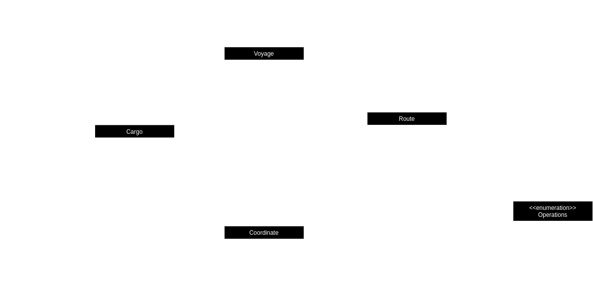

# KT Clean Arch - Laboratório

## Sobre Empresa Papa Léguas Logística...

A empresa Papa Léguas Logística é uma referência interplanetária quando o assunto refere-se a fretamentos e entregas; com fama conquistada em inumeras galáxias e sistemas planetários, a precupação em excelência sempre foi uma constante no dia a dia da organização, e isso tornou a reestruturação de seu sistema de remessas um assunto inadiável. Sua aplicação atual não é deficitária do ponto de vista funcional - e nem mesmo do sob o aspecto técnológico, mas a preocupação do time de desenvolvimento passou a ser a forma em si e não o conteúdo, isto é, como a solução foi estruturada arquiteturalmente.

O time de tecnologia já teve problemas no passado ao migrar de tecnologia quando decidiu-se adotar o Spring, pois foi necessário reestruturar toda a aplicação, praticamente reescrevendo-a do zero, o que foi muito desgastante e provocou inúmeros erros; Godofredo, um dos desenvolvedores, ouviu falar que uma certa equipe tem o conhecimento de um certo padrão arquitetural que é capaz de isolar a parte da regra de negócios e tornar futuros processos de migração (ou mesmo evolução) mais seguros e simples, e resolveu contáta-los...

Será que essa equipe poderá ajudar a Papa Léguas Logística a construir uma solução mais robusta?!

### O que se sabe a respeito do domínio...

O sistema desenvolvido pela Papa Léguas Logística ainda é muuuuuuuuito incipiente... o que justifica a intenção do time de TI em mudar a abordagem arquitetural, já que os impactos serão mínimos; basicamente eles estão saindo de sua sprint 0, e possuem apenas uma funcionalidade criada, que é justamente a funcionalidade que será migrada — que corresponde à criação de uma nova expedição.

#### Criando uma nova expedição
O conceito de expedição, no contexto de domínio da Papa Léguas, consiste em um transporte de cargas. Para tal, faz-se necessário que alguns requisitos sejam atendidos, a saber:

1. Primeiramente, é necessário (obviamente) que se possua uma **CARGA** para translado; cada carga deve possuir uma indicação de onde foi carregada e onde foi descarregada, além de sinalizar seu peso.
2. **ROTAS** são responsáveis por registrar o mapa usado na viagem; cada rota possui o local de partida (origem) e qual o destino desejado, além da operação executada na origem (se foi realizada uma *CARGA* ou uma *DESCARGA*); por fim, é sempre preciso apontar o horário de chegada ao destino e o horário de partida da origem.
3. A EXPEDIÇÃO representa a viagem em si; ela deve conter o registros das cargas transportadas (deve-se ter **ao menos uma remessa a ser transportada**, embora idealmente (por questões de otimizização) se dejese que múltiplos itens sejam transportados em cada viagem) e também o roteiro ustilizado (um conjunto de rotas). Além disso, toda viagem possui uma origem (que corresponde também à rota inicial) e um destino (igual à rota final), além de uma capacidade máxima, que indica o limite de peso que o meio de transporte é capaz de carregar; porém há um detalhe importante aqui: **como ocasionalmente ocorrem desistencias no envio, a Papa Léguas decidiu adotar o conceito de *overbooking* que consiste em vender mais do que o transporte é capaz de carregar; para isso, ao fazer o carregamento, ela sempre considera que o limite de peso é 10% maior que o limite efetivo; no entando, no momento de criar de fato a expedição ela aplica uma regra que para remover da viagem a carga mais leve que mais se aproxime do valor excedido, a qual será colocada na próxima viagem**. Essa regra possibilita que eles sempre trabalhem com máximo aproveitamento dos meios de transporte.
