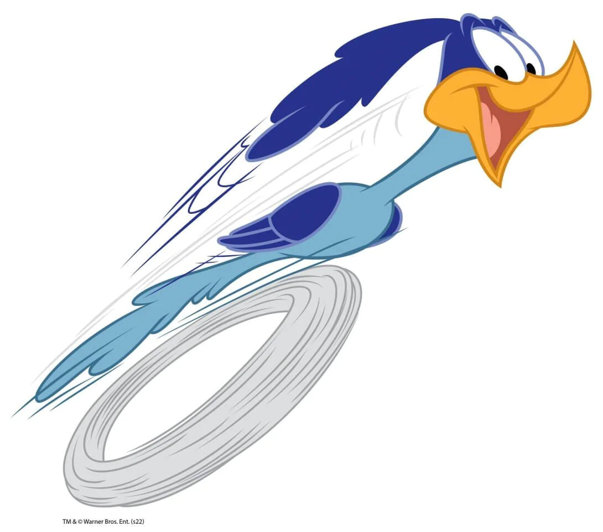

# KT Clean Arch - Laboratório

## Sobre Empresa Papa Léguas Logística...

A empresa Papa Léguas Logística é uma referência interplanetária quando o assunto refere-se a fretamentos e entregas; com fama conquistada em inumeras galáxias e sistemas planetários, 
a precupação em excelência sempre foi uma constante no dia a dia da organização, e isso tornou a reestruturação de seu sistema de remessas um assunto inadiável. Sua aplicação atual 
não é deficitária do ponto de vista funcional - e nem mesmo do sob o aspecto técnológico, mas a preocupação do time de desenvolvimento passou a ser a forma em si e não o conteúdo, 
isto é, como a solução foi estruturada arquiteturalmente.
\
O time de tecnologia já teve problemas no passado ao migrar de tecnologia quando decidiu-se adotar o Spring, pois foi necessário reestruturar toda a aplicação, praticamente
reescrevendo-a do zero, o que foi muito desgastante e provocou inúmeros erros; Godofredo, um dos desenvolvedores, ouviu falar que uma certa equipe tem o conhecimento de um certo 
padrão arquitetural que é capaz de isolar a parte da regra de negócios e tornar futuros processos de migração (ou mesmo evolução) mais seguros e simples, e resolveu contáta-los...
\
Será que essa equipe poderá ajudar a Papa Léguas Logística a construir uma solução mais robusta?!
